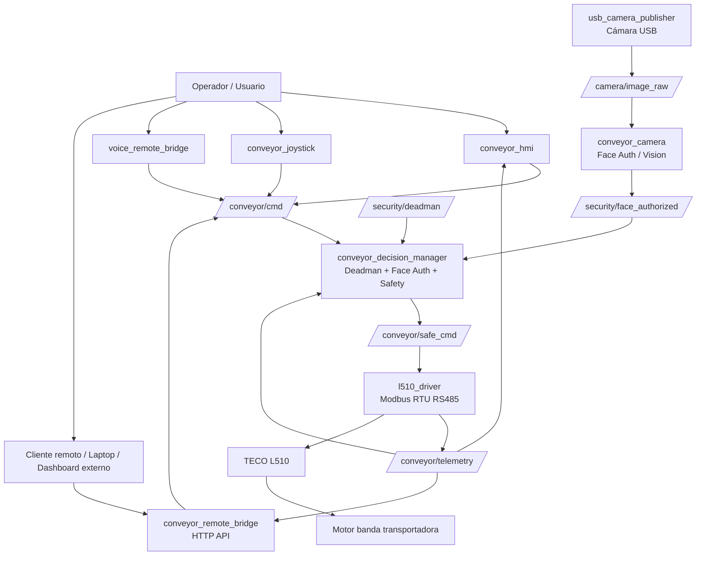
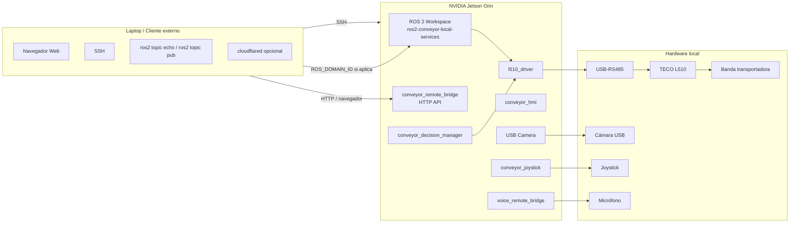
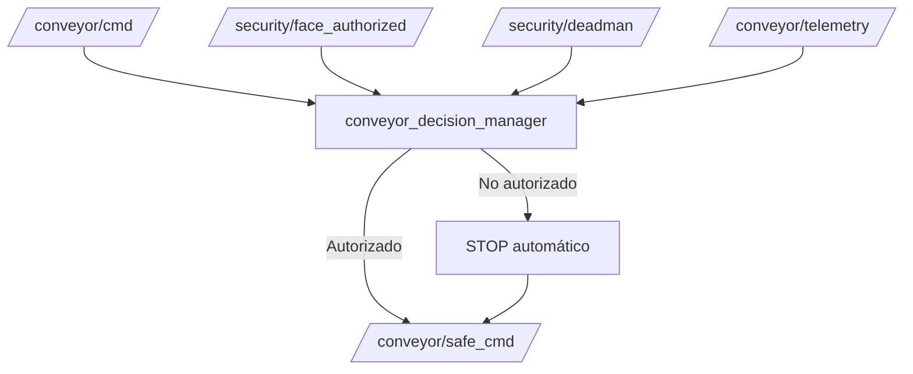
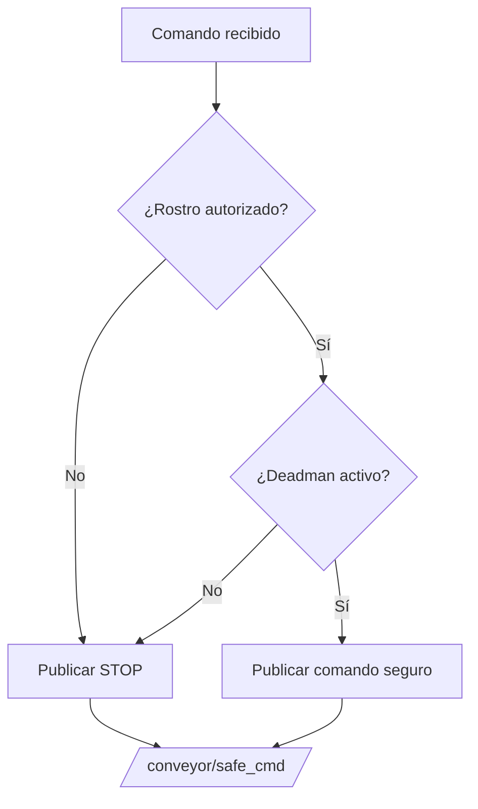

# 🤖 ros2-conveyor-local-services

<div align="center">

# Sistema Local ROS 2 para Banda Transportadora Inteligente

**Control, telemetría, seguridad y operación local de una banda transportadora usando ROS 2, Jetson Orin, TECO L510, cámara, joystick, HMI, voz y servicios HTTP.**

<br>


</div>

---

## 📌 Descripción general

`ros2-conveyor-local-services` contiene los servicios locales principales para operar una banda transportadora inteligente desde una **NVIDIA Jetson Orin** usando **ROS 2**.

El sistema integra:

- Control de banda transportadora mediante **variador TECO L510** por **Modbus RTU / RS485**.
- Publicación y lectura de telemetría del variador.
- Control desde interfaz HMI local.
- Control por joystick.
- Control o comandos por voz.
- Cámara USB para visión local.
- Capa de seguridad con **deadman switch** y **autenticación facial**.
- Puente local/remoto mediante servicios HTTP.
- Comunicación modular entre paquetes usando tópicos ROS 2.

> En esta versión del sistema, todos los paquetes corren directamente en la **Jetson**, evitando depender de una laptop para la ejecución principal. La laptop puede usarse únicamente como cliente externo para visualizar dashboard, monitorear tópicos, hacer SSH o consumir endpoints HTTP.

---

## 🧠 Objetivo del repositorio

Este repositorio busca separar el sistema de banda transportadora en paquetes ROS 2 claros, reutilizables y mantenibles.

La idea principal es que cada módulo tenga una responsabilidad específica:

- Un paquete controla el L510.
- Otro publica cámara.
- Otro maneja joystick.
- Otro maneja HMI.
- Otro traduce comandos remotos HTTP a tópicos ROS.
- Otro toma decisiones de seguridad y operación.
- Otro permite entrada por voz.

Así se evita tener un único código gigante y se facilita probar, depurar y reemplazar módulos.

---

## 🧩 Arquitectura general del sistema



---

## 🖥️ Flujo Jetson ↔ Laptop

Aunque el sistema corre directamente en la Jetson, la laptop puede conectarse para desarrollo, monitoreo o control remoto.



### Flujo recomendado

1. La **Jetson** inicia el workspace ROS 2.
2. Se levantan los nodos locales.
3. El `l510_driver` abre el puerto `/dev/l510` o `/dev/ttyUSB0`.
4. Los comandos llegan desde HMI, joystick, voz o HTTP.
5. `conveyor_decision_manager` valida seguridad.
6. Si el sistema está autorizado, se publica comando seguro.
7. `l510_driver` envía comando Modbus al L510.
8. El L510 mueve la banda.
9. La telemetría regresa por `/conveyor/telemetry`.
10. HMI/API muestran estado, frecuencia, corriente y errores.

---

## 📦 Paquetes del repositorio

```text
ros2-conveyor-local-services/
├── conveyor_camera/
├── conveyor_decision_manager/
├── conveyor_hmi/
├── conveyor_joystick/
├── conveyor_remote_bridge/
├── l510_driver/
├── usb_camera_publisher/
├── voice_remote_bridge/
├── README.md
├── requirements_python.txt
├── ros2_requirements.txt
└── .gitignore
```

---

## 1. `l510_driver`

Paquete encargado de controlar el variador **TECO L510** mediante **Modbus RTU sobre RS485**.

### Funciones

- Abrir puerto serial RS485.
- Enviar comandos RUN/STOP.
- Cambiar dirección.
- Cambiar frecuencia.
- Leer telemetría.
- Publicar estado del variador.
- Detectar errores de comunicación.

### Hardware relacionado

- TECO L510.
- Adaptador USB-RS485.
- Motor de la banda.
- Puerto típico: `/dev/ttyUSB0`.
- Alias recomendado: `/dev/l510`.

### Tópicos

| Tópico | Tipo | Dirección | Descripción |
|---|---|---|---|
| `/conveyor/cmd` | `std_msgs/String` o mensaje custom | Entrada | Comando de movimiento |
| `/conveyor/safe_cmd` | `std_msgs/String` o mensaje custom | Entrada | Comando validado por seguridad |
| `/conveyor/telemetry` | `std_msgs/String` o mensaje custom | Salida | Telemetría del L510 |

### Ejemplo de telemetría

```json
{
  "state": 7,
  "error": 0,
  "freq_cmd_hz": 60.0,
  "freq_out_hz": 60.0,
  "current_raw": 5,
  "timestamp": 1777419916.3505065
}
```

### Comandos de ejecución

```bash
ros2 run l510_driver l510_node
```

Con parámetros:

```bash
ros2 run l510_driver l510_node \
  --ros-args \
  -p port:=/dev/ttyUSB0 \
  -p slave:=1 \
  -p baudrate:=9600
```

Usando alias recomendado:

```bash
ros2 run l510_driver l510_node \
  --ros-args \
  -p port:=/dev/l510 \
  -p slave:=1 \
  -p baudrate:=9600
```

Launch sugerido:

```bash
ros2 launch l510_driver l510.launch.py
```

---

## 2. `conveyor_hmi`

Paquete encargado de la interfaz local de operación.

### Funciones

- Mostrar botones de control:
  - Forward
  - Reverse
  - Stop
- Mostrar slider de velocidad.
- Mostrar telemetría:
  - Velocidad comandada.
  - Velocidad real.
  - Corriente.
  - Estado.
  - Error.
  - Timestamp.
- Publicar comandos hacia la banda.

### Tópicos

| Tópico | Tipo | Dirección | Descripción |
|---|---|---|---|
| `/conveyor/cmd` | Comando de banda | Salida | Comando generado por HMI |
| `/conveyor/telemetry` | Telemetría | Entrada | Datos del L510 |

### Ejecución

```bash
ros2 run conveyor_hmi conveyor_hmi_node
```

Launch sugerido:

```bash
ros2 launch conveyor_hmi conveyor_hmi.launch.py
```

---

## 3. `conveyor_joystick`

Paquete que convierte entradas de joystick en comandos para la banda.

### Funciones

- Leer mensajes de joystick.
- Mapear botones a:
  - Forward.
  - Reverse.
  - Stop.
  - Deadman.
- Mapear eje analógico a velocidad.
- Publicar comandos hacia la banda.

### Tópicos

| Tópico | Tipo | Dirección | Descripción |
|---|---|---|---|
| `/joy` | `sensor_msgs/msg/Joy` | Entrada | Lectura cruda del joystick |
| `/conveyor/cmd` | Comando de banda | Salida | Comando convertido |

### Ejecución

Nodo de joystick ROS:

```bash
ros2 run joy joy_node
```

Bridge del sistema:

```bash
ros2 run conveyor_joystick conveyor_joystick_node
```

Launch sugerido:

```bash
ros2 launch conveyor_joystick conveyor_joystick.launch.py
```

---

## 4. `usb_camera_publisher`

Paquete encargado de publicar video desde una cámara USB.

### Funciones

- Abrir cámara USB.
- Capturar frames.
- Publicar imágenes en ROS 2.
- Servir como fuente para visión, HMI o autenticación facial.

### Tópicos

| Tópico | Tipo | Dirección | Descripción |
|---|---|---|---|
| `/camera/image_raw` | `sensor_msgs/msg/Image` | Salida | Imagen cruda de cámara |
| `/camera/camera_info` | `sensor_msgs/msg/CameraInfo` | Salida opcional | Información de cámara |

### Ejecución

```bash
ros2 run usb_camera_publisher usb_camera_publisher_node
```

Con parámetros:

```bash
ros2 run usb_camera_publisher usb_camera_publisher_node \
  --ros-args \
  -p camera_index:=0 \
  -p frame_id:=usb_camera
```

Launch sugerido:

```bash
ros2 launch usb_camera_publisher usb_camera.launch.py
```

---

## 5. `conveyor_camera`

Paquete relacionado con visión local y autenticación facial.

### Funciones

- Suscribirse a la cámara.
- Detectar rostros.
- Clasificar usuarios autorizados.
- Publicar estado de autenticación.
- Apoyar la capa de seguridad del sistema.

### Tópicos

| Tópico | Tipo | Dirección | Descripción |
|---|---|---|---|
| `/camera/image_raw` | `sensor_msgs/msg/Image` | Entrada | Imagen de cámara |
| `/security/face_authorized` | `std_msgs/msg/Bool` | Salida | Indica si el usuario está autorizado |
| `/security/face_label` | `std_msgs/msg/String` | Salida opcional | Nombre o clase detectada |

### Ejecución

```bash
ros2 run conveyor_camera conveyor_camera_node
```

Para preprocesamiento o registro de usuarios, si el paquete incluye utilidades:

```bash
ros2 run conveyor_camera preprocess_faces
```

```bash
ros2 run conveyor_camera register_faces_offline
```

Launch sugerido:

```bash
ros2 launch conveyor_camera conveyor_camera.launch.py
```

---

## 6. `conveyor_decision_manager`

Paquete encargado de la lógica de seguridad, permisos y decisión final.

### Funciones

- Recibir comandos desde HMI, joystick, voz o API.
- Verificar si hay autorización facial.
- Verificar si el deadman está activo.
- Bloquear comandos inseguros.
- Enviar únicamente comandos seguros hacia el driver.
- Aplicar STOP automático si se pierde autorización.

### Arquitectura interna



### Tópicos

| Tópico | Tipo | Dirección | Descripción |
|---|---|---|---|
| `/conveyor/cmd` | Comando de banda | Entrada | Comando solicitado |
| `/security/face_authorized` | `std_msgs/msg/Bool` | Entrada | Autenticación facial |
| `/security/deadman` | `std_msgs/msg/Bool` | Entrada | Botón de seguridad/deadman |
| `/conveyor/telemetry` | Telemetría | Entrada | Estado actual |
| `/conveyor/safe_cmd` | Comando de banda | Salida | Comando validado |

### Ejecución

```bash
ros2 run conveyor_decision_manager decision_manager_node
```

Launch sugerido:

```bash
ros2 launch conveyor_decision_manager decision_manager.launch.py
```

---

## 7. `conveyor_remote_bridge`

Paquete que permite controlar y monitorear la banda desde servicios HTTP.

### Funciones

- Exponer endpoints HTTP.
- Convertir peticiones HTTP a tópicos ROS 2.
- Leer telemetría desde ROS 2.
- Permitir integración con dashboard web, laptop o túnel público.
- Servir como puente local entre ROS y clientes externos.

### Endpoints HTTP sugeridos/documentados

> Los nombres pueden adaptarse al código final del paquete, pero esta es la estructura recomendada para documentar y mantener la API.

| Método | Endpoint | Descripción |
|---|---|---|
| `GET` | `/health` | Verifica que el servicio HTTP esté vivo |
| `GET` | `/api/telemetry` | Devuelve última telemetría de la banda |
| `POST` | `/api/conveyor/forward` | Solicita movimiento hacia adelante |
| `POST` | `/api/conveyor/reverse` | Solicita movimiento en reversa |
| `POST` | `/api/conveyor/stop` | Solicita paro |
| `POST` | `/api/conveyor/speed` | Cambia velocidad/frecuencia |
| `GET` | `/api/security/status` | Devuelve estado de seguridad |
| `POST` | `/api/security/deadman` | Actualiza estado deadman si aplica |

### Ejemplos con `curl`

Health check:

```bash
curl http://localhost:8000/health
```

Enviar forward:

```bash
curl -X POST http://localhost:8000/api/conveyor/forward
```

Enviar stop:

```bash
curl -X POST http://localhost:8000/api/conveyor/stop
```

Enviar velocidad:

```bash
curl -X POST http://localhost:8000/api/conveyor/speed \
  -H "Content-Type: application/json" \
  -d '{"speed_hz": 30.0}'
```

Consultar telemetría:

```bash
curl http://localhost:8000/api/telemetry
```

### Ejecución

```bash
ros2 run conveyor_remote_bridge conveyor_remote_bridge_node
```

Si usa FastAPI/Uvicorn directamente:

```bash
uvicorn conveyor_remote_bridge.api:app --host 0.0.0.0 --port 8000
```

Launch sugerido:

```bash
ros2 launch conveyor_remote_bridge conveyor_remote_bridge.launch.py
```

### Exponer dashboard/API con cloudflared

```bash
cloudflared tunnel --url http://localhost:8000
```

---

## 8. `voice_remote_bridge`

Paquete encargado de interpretar comandos de voz y convertirlos en comandos ROS 2.

### Funciones

- Leer micrófono.
- Reconocer comandos de voz.
- Convertir palabras clave en acciones.
- Publicar comandos hacia la banda.

### Comandos de voz sugeridos

| Comando | Acción |
|---|---|
| "avanza" | Forward |
| "adelante" | Forward |
| "reversa" | Reverse |
| "detente" | Stop |
| "alto" | Stop |
| "velocidad treinta" | Cambiar frecuencia |

### Tópicos

| Tópico | Tipo | Dirección | Descripción |
|---|---|---|---|
| `/voice/command` | `std_msgs/msg/String` | Salida opcional | Texto reconocido |
| `/conveyor/cmd` | Comando de banda | Salida | Comando generado por voz |

### Ejecución

```bash
ros2 run voice_remote_bridge voice_remote_bridge_node
```

Launch sugerido:

```bash
ros2 launch voice_remote_bridge voice_remote_bridge.launch.py
```

---

## 🔐 Security layer: Deadman + Face Auth

El sistema incluye una capa de seguridad antes de permitir que un comando llegue al `l510_driver`.

### Componentes

| Componente | Función |
|---|---|
| Deadman switch | Obliga al operador a mantener una condición activa de seguridad |
| Face Auth | Verifica si el usuario detectado está autorizado |
| Decision Manager | Decide si el comando puede pasar |
| STOP automático | Detiene la banda cuando no se cumplen condiciones |

### Reglas de seguridad



### Comportamiento esperado

- Si no hay rostro autorizado: la banda no debe correr.
- Si se pierde autorización facial: debe mandarse STOP.
- Si se suelta el deadman: debe mandarse STOP.
- Si existe error del L510: debe bloquearse movimiento.
- Si el comando viene de HTTP, voz, HMI o joystick, todos deben pasar por la misma validación.

---

## ⚙️ TECO L510

El variador TECO L510 fue configurado para recibir comandos por comunicación serial.

### Parámetros configurados

| Parámetro | Valor | Descripción |
|---|---:|---|
| `00-02` | `2` | Fuente de RUN por comunicación |
| `00-03` | `0` | Dirección controlada por comunicación |
| `00-05` | `5` | Fuente de frecuencia por comunicación |
| `00-06` | `2` | Referencia secundaria por comunicación |
| `09-00` | `1` | Slave ID Modbus |
| `09-01` | `0` | Configuración comunicación |
| `09-02` | `1` | Configuración comunicación |
| `09-03` | `0` | Configuración comunicación |
| `09-04` | `0` | Configuración comunicación |
| `09-05` | `0` | Configuración comunicación |

### Comunicación serial validada

| Parámetro | Valor |
|---|---|
| Puerto típico | `/dev/ttyUSB0` |
| Alias recomendado | `/dev/l510` |
| Baudrate | `9600` |
| Paridad | `N` |
| Stop bits | `1` |
| Data bits | `8` |
| Protocolo | Modbus RTU |
| Slave ID | `1` |

### Registros Modbus validados

| Registro decimal | Nombre | Descripción |
|---:|---|---|
| `9473` | `op_signal_cmd` | Comando/control word |
| `9474` | `freq_cmd_wr` | Escritura de frecuencia comandada |
| `9504` | `state_signal` | Estado del variador |
| `9505` | `error_desc` | Código de error |
| `9506` | `di_state` | Estado de entradas digitales |
| `9507` | `freq_cmd_rd` | Frecuencia comandada leída |
| `9508` | `freq_out` | Frecuencia real de salida |
| `9511` | `current_out` | Corriente del motor |

### Escala de frecuencia

El L510 usa escala de centésimas de Hz:

```text
6000 = 60.00 Hz
3000 = 30.00 Hz
1500 = 15.00 Hz
```

### Estados observados

| Valor | Significado |
|---:|---|
| `4` | STOP |
| `7` | RUN |
| `0` en error | Sin error |
| `26` en error | Estado de error/stop observado durante pruebas |

---

## 📡 ROS Topics principales

| Tópico | Tipo sugerido | Publica | Consume | Descripción |
|---|---|---|---|---|
| `/conveyor/cmd` | `std_msgs/String` o custom | HMI, joystick, voz, HTTP | decision_manager | Comando solicitado |
| `/conveyor/safe_cmd` | `std_msgs/String` o custom | decision_manager | l510_driver | Comando validado |
| `/conveyor/telemetry` | `std_msgs/String` o custom | l510_driver | HMI, API, decision_manager | Telemetría del L510 |
| `/camera/image_raw` | `sensor_msgs/msg/Image` | usb_camera_publisher | conveyor_camera, HMI | Imagen de cámara |
| `/camera/camera_info` | `sensor_msgs/msg/CameraInfo` | usb_camera_publisher | visión | Info de cámara |
| `/joy` | `sensor_msgs/msg/Joy` | joy_node | conveyor_joystick | Joystick crudo |
| `/security/face_authorized` | `std_msgs/msg/Bool` | conveyor_camera | decision_manager | Autorización facial |
| `/security/face_label` | `std_msgs/msg/String` | conveyor_camera | HMI/API | Usuario detectado |
| `/security/deadman` | `std_msgs/msg/Bool` | joystick/HMI/API | decision_manager | Estado deadman |
| `/voice/command` | `std_msgs/msg/String` | voice_remote_bridge | HMI/API opcional | Texto reconocido |

---

## 📥 Formato recomendado de comando

Si se usa `std_msgs/String`, se recomienda publicar JSON.

### Forward

```bash
ros2 topic pub /conveyor/cmd std_msgs/msg/String \
"{data: '{\"run\": true, \"direction\": 1, \"speed_hz\": 30.0}'}"
```

### Reverse

```bash
ros2 topic pub /conveyor/cmd std_msgs/msg/String \
"{data: '{\"run\": true, \"direction\": -1, \"speed_hz\": 30.0}'}"
```

### Stop

```bash
ros2 topic pub /conveyor/cmd std_msgs/msg/String \
"{data: '{\"run\": false, \"direction\": 0, \"speed_hz\": 0.0}'}"
```

---

## 📤 Formato recomendado de telemetría

```json
{
  "state": 7,
  "error": 0,
  "freq_cmd_hz": 60.0,
  "freq_out_hz": 60.0,
  "current_raw": 5,
  "timestamp": 1777419916.3505065
}
```

### Ver telemetría

```bash
ros2 topic echo /conveyor/telemetry
```

---

## 🚀 Instalación

### 1. Crear workspace

```bash
mkdir -p ~/ros2_ws/src
cd ~/ros2_ws/src
```

### 2. Clonar repositorio

```bash
git clone https://github.com/DidierHernandez2/ros2-conveyor-local-services.git
cd ~/ros2_ws
```

### 3. Instalar dependencias del sistema

```bash
sudo apt update
sudo apt install -y \
  python3-pip \
  python3-venv \
  python3-colcon-common-extensions \
  python3-rosdep \
  git \
  v4l-utils \
  joystick \
  jstest-gtk \
  minicom \
  setserial
```

### 4. Inicializar rosdep

```bash
sudo rosdep init
rosdep update
```

Si `rosdep init` ya fue ejecutado antes, solamente usar:

```bash
rosdep update
```

### 5. Instalar dependencias ROS

Desde la raíz del workspace:

```bash
cd ~/ros2_ws
rosdep install --from-paths src -y --ignore-src
```

### 6. Instalar dependencias Python

Si el repo contiene `requirements_python.txt`:

```bash
pip3 install -r src/ros2-conveyor-local-services/requirements_python.txt
```

Dependencias comunes:

```bash
pip3 install pymodbus pyserial fastapi uvicorn opencv-python numpy websockets
```

### 7. Compilar

```bash
cd ~/ros2_ws
colcon build --symlink-install
```

### 8. Cargar entorno

```bash
source install/setup.bash
```

Para dejarlo permanente:

```bash
echo "source ~/ros2_ws/install/setup.bash" >> ~/.bashrc
source ~/.bashrc
```

---

## ▶️ Ejecución rápida

### Terminal 1: cargar ROS 2

```bash
source /opt/ros/humble/setup.bash
source ~/ros2_ws/install/setup.bash
```

### Terminal 2: driver L510

```bash
ros2 run l510_driver l510_node \
  --ros-args \
  -p port:=/dev/l510 \
  -p slave:=1 \
  -p baudrate:=9600
```

### Terminal 3: decision manager

```bash
ros2 run conveyor_decision_manager decision_manager_node
```

### Terminal 4: HMI

```bash
ros2 run conveyor_hmi conveyor_hmi_node
```

### Terminal 5: cámara

```bash
ros2 run usb_camera_publisher usb_camera_publisher_node
```

### Terminal 6: joystick

```bash
ros2 run joy joy_node
ros2 run conveyor_joystick conveyor_joystick_node
```

### Terminal 7: API remota

```bash
ros2 run conveyor_remote_bridge conveyor_remote_bridge_node
```

---

## 🚀 Ejecución con launch

Si cada paquete cuenta con archivo launch:

```bash
ros2 launch l510_driver l510.launch.py
ros2 launch conveyor_hmi conveyor_hmi.launch.py
ros2 launch conveyor_joystick conveyor_joystick.launch.py
ros2 launch usb_camera_publisher usb_camera.launch.py
ros2 launch conveyor_camera conveyor_camera.launch.py
ros2 launch conveyor_decision_manager decision_manager.launch.py
ros2 launch conveyor_remote_bridge conveyor_remote_bridge.launch.py
ros2 launch voice_remote_bridge voice_remote_bridge.launch.py
```

Launch general recomendado para el repositorio:

```bash
ros2 launch conveyor_bringup local_conveyor.launch.py
```

o, si el bringup vive dentro del mismo repo:

```bash
ros2 launch ros2_conveyor_local_services local_services.launch.py
```

---

## 🧪 Pruebas básicas

### Ver tópicos activos

```bash
ros2 topic list
```

### Ver telemetría

```bash
ros2 topic echo /conveyor/telemetry
```

### Ver cámara

```bash
ros2 topic echo /camera/image_raw
```

O con herramientas gráficas:

```bash
ros2 run rqt_image_view rqt_image_view
```

### Ver joystick

```bash
ros2 topic echo /joy
```

### Publicar comando manual

Forward a 30 Hz:

```bash
ros2 topic pub /conveyor/cmd std_msgs/msg/String \
"{data: '{\"run\": true, \"direction\": 1, \"speed_hz\": 30.0}'}"
```

Stop:

```bash
ros2 topic pub /conveyor/cmd std_msgs/msg/String \
"{data: '{\"run\": false, \"direction\": 0, \"speed_hz\": 0.0}'}"
```

---

## 🔌 Alias `/dev/*` recomendados

Para evitar que los dispositivos cambien de nombre entre reinicios, se recomienda crear reglas `udev`.

### Dispositivos sugeridos

| Dispositivo | Puerto dinámico | Alias recomendado |
|---|---|---|
| USB-RS485 L510 | `/dev/ttyUSB0` | `/dev/l510` |
| Cámara USB | `/dev/video0` | `/dev/conveyor_camera` |
| Joystick | `/dev/input/js0` | `/dev/conveyor_joystick` |
| Micrófono | ALSA device | Configurar por nombre ALSA |

---

## Crear regla udev para L510

### 1. Identificar dispositivo

Conecta el USB-RS485 y ejecuta:

```bash
lsusb
```

Ejemplo observado para adaptador CH340/CH341:

```text
1a86:7523 QinHeng Electronics CH340 serial converter
```

También puedes usar:

```bash
udevadm info -a -n /dev/ttyUSB0
```

### 2. Crear archivo de reglas

```bash
sudo nano /etc/udev/rules.d/99-conveyor.rules
```

Contenido sugerido:

```udev
# USB-RS485 para TECO L510
SUBSYSTEM=="tty", ATTRS{idVendor}=="1a86", ATTRS{idProduct}=="7523", SYMLINK+="l510", MODE="0666", GROUP="dialout"

# Cámara USB de la banda
SUBSYSTEM=="video4linux", ATTRS{idVendor}=="046d", SYMLINK+="conveyor_camera", MODE="0666"

# Joystick de la banda
KERNEL=="js[0-9]*", SUBSYSTEM=="input", SYMLINK+="conveyor_joystick", MODE="0666"
```

> Ajusta `idVendor` e `idProduct` según el resultado real de `lsusb`.

### 3. Recargar reglas

```bash
sudo udevadm control --reload-rules
sudo udevadm trigger
```

### 4. Verificar

```bash
ls -l /dev/l510
```

---

## 🔐 Permisos de puerto serial

Agregar usuario al grupo `dialout`:

```bash
sudo usermod -aG dialout $USER
```

Después cerrar sesión y volver a entrar, o reiniciar:

```bash
sudo reboot
```

Verificar:

```bash
groups
```

---

## 🌐 Cloudflared para acceso remoto

Para exponer temporalmente el dashboard o API:

```bash
cloudflared tunnel --url http://localhost:8000
```

Esto genera una URL pública temporal para entrar desde otra computadora o celular.

---

## 🧰 Troubleshooting

### 1. Error: `Permission denied: /dev/ttyUSB0`

**Causa probable:** el usuario no pertenece al grupo `dialout`.

**Solución:**

```bash
sudo usermod -aG dialout $USER
sudo reboot
```

También revisar permisos:

```bash
ls -l /dev/ttyUSB0
```

---

### 2. Error: `No response received after 3 retries`

**Causas posibles:**

- La banda está apagada.
- El L510 no está energizado.
- Cable RS485 mal conectado.
- Slave ID incorrecto.
- Baudrate incorrecto.
- Parámetros del L510 no están en modo comunicación.
- Otro proceso está usando el puerto.

**Soluciones:**

Verificar que la banda esté encendida.

Revisar puerto:

```bash
ls /dev/ttyUSB*
```

Revisar quién usa el puerto:

```bash
sudo lsof /dev/ttyUSB0
```

Cerrar proceso si es necesario:

```bash
kill -9 <PID>
```

Ejecutar con parámetros correctos:

```bash
ros2 run l510_driver l510_node \
  --ros-args \
  -p port:=/dev/ttyUSB0 \
  -p slave:=1 \
  -p baudrate:=9600
```

---

### 3. La telemetría aparece en `null`

Ejemplo:

```yaml
data: '{"state": null, "error": null, "freq_cmd_hz": null, "freq_out_hz": null, "current_raw": null, "timestamp": 1777419916.3505065}'
```

**Causas posibles:**

- El L510 no responde.
- Registro incorrecto.
- El driver está publicando aunque no haya lectura válida.
- Timeout Modbus.
- Banda apagada.
- Puerto tomado por otro nodo.

**Solución:**

1. Verificar energía.
2. Verificar puerto.
3. Verificar `slave:=1`.
4. Verificar parámetros del L510.
5. Reiniciar nodo.
6. Revisar con `lsof`.

---

### 4. El puerto cambia de `/dev/ttyUSB0` a `/dev/ttyUSB1`

**Solución:** crear alias `/dev/l510` con reglas `udev`.

---

### 5. El joystick no publica `/joy`

Verificar dispositivo:

```bash
ls /dev/input/js*
```

Probar joystick:

```bash
jstest /dev/input/js0
```

Ejecutar nodo:

```bash
ros2 run joy joy_node
```

Ver tópico:

```bash
ros2 topic echo /joy
```

---

### 6. La cámara no abre

Verificar cámaras:

```bash
v4l2-ctl --list-devices
```

Probar cámara:

```bash
cheese
```

o:

```bash
ffplay /dev/video0
```

Ver permisos:

```bash
ls -l /dev/video0
```

---

### 7. El sistema no encuentra paquetes después de compilar

Verifica que cargaste el entorno:

```bash
source /opt/ros/humble/setup.bash
source ~/ros2_ws/install/setup.bash
```

Ver paquetes:

```bash
ros2 pkg list | grep conveyor
```

---

### 8. `colcon build` falla por dependencias

Ejecutar:

```bash
rosdep install --from-paths src -y --ignore-src
```

Limpiar build:

```bash
rm -rf build install log
colcon build --symlink-install
```

---

### 9. El L510 no corre aunque el nodo conecta

Revisar parámetros del variador:

```text
00-02 = 2
00-03 = 0
00-05 = 5
00-06 = 2
09-00 = 1
09-01 = 0
09-02 = 1
09-03 = 0
09-04 = 0
09-05 = 0
```

Revisar que la frecuencia no esté en cero.

---

### 10. Otro nodo tiene tomado el puerto

Ver:

```bash
sudo lsof /dev/ttyUSB0
```

Ejemplo:

```text
COMMAND     PID  USER   FD   TYPE DEVICE SIZE/OFF NODE NAME
l510_node 12701 darhf   37uW  CHR  188,0      0t0 1171 /dev/ttyUSB0
```

Matar proceso:

```bash
kill -9 12701
```

---

## 🧪 Comandos útiles de debugging ROS 2

Listar nodos:

```bash
ros2 node list
```

Listar tópicos:

```bash
ros2 topic list
```

Ver tipo de tópico:

```bash
ros2 topic type /conveyor/telemetry
```

Ver frecuencia:

```bash
ros2 topic hz /conveyor/telemetry
```

Ver datos:

```bash
ros2 topic echo /conveyor/telemetry
```

Ver parámetros de nodo:

```bash
ros2 param list
```

Publicar comando:

```bash
ros2 topic pub /conveyor/cmd std_msgs/msg/String \
"{data: '{\"run\": true, \"direction\": 1, \"speed_hz\": 20.0}'}"
```

---

## 🧱 Estructura recomendada detallada

```text
ros2-conveyor-local-services/
├── README.md
├── .gitignore
├── requirements_python.txt
├── ros2_requirements.txt
│
├── l510_driver/
│   ├── package.xml
│   ├── setup.py
│   ├── resource/
│   ├── launch/
│   │   └── l510.launch.py
│   └── l510_driver/
│       ├── __init__.py
│       └── l510_node.py
│
├── conveyor_hmi/
│   ├── package.xml
│   ├── setup.py
│   ├── launch/
│   │   └── conveyor_hmi.launch.py
│   └── conveyor_hmi/
│       ├── __init__.py
│       └── conveyor_hmi_node.py
│
├── conveyor_joystick/
│   ├── package.xml
│   ├── setup.py
│   ├── launch/
│   │   └── conveyor_joystick.launch.py
│   └── conveyor_joystick/
│       ├── __init__.py
│       └── conveyor_joystick_node.py
│
├── usb_camera_publisher/
│   ├── package.xml
│   ├── setup.py
│   ├── launch/
│   │   └── usb_camera.launch.py
│   └── usb_camera_publisher/
│       ├── __init__.py
│       └── usb_camera_publisher_node.py
│
├── conveyor_camera/
│   ├── package.xml
│   ├── setup.py
│   ├── launch/
│   │   └── conveyor_camera.launch.py
│   └── conveyor_camera/
│       ├── __init__.py
│       └── conveyor_camera_node.py
│
├── conveyor_decision_manager/
│   ├── package.xml
│   ├── setup.py
│   ├── launch/
│   │   └── decision_manager.launch.py
│   └── conveyor_decision_manager/
│       ├── __init__.py
│       └── decision_manager_node.py
│
├── conveyor_remote_bridge/
│   ├── package.xml
│   ├── setup.py
│   ├── launch/
│   │   └── conveyor_remote_bridge.launch.py
│   └── conveyor_remote_bridge/
│       ├── __init__.py
│       ├── conveyor_remote_bridge_node.py
│       └── api.py
│
└── voice_remote_bridge/
    ├── package.xml
    ├── setup.py
    ├── launch/
    │   └── voice_remote_bridge.launch.py
    └── voice_remote_bridge/
        ├── __init__.py
        └── voice_remote_bridge_node.py
```

---

## 📄 `.gitignore` recomendado

```gitignore
# ROS 2 build artifacts
build/
install/
log/

# Python
__pycache__/
*.py[cod]
*.pyo
*.pyd
.Python
venv/
.env/
.venv/
pip-wheel-metadata/
*.egg-info/

# Colcon
.colcon/

# IDEs
.vscode/
.idea/

# OS
.DS_Store
Thumbs.db

# Logs
*.log

# Temporary files
*.tmp
*.bak
*.swp

# Camera / generated data
captures/
recordings/
*.avi
*.mp4
*.bag
*.db3

# Face recognition generated files
face_generated/
*.npz
*.pkl

# Secrets
.env
secrets.json
```

---

## 📦 Archivos de dependencias recomendados

### `requirements_python.txt`

```text
fastapi
uvicorn
pymodbus
pyserial
opencv-python
numpy
websockets
python-dotenv
PyYAML
vosk
torch
facenet-pytorch
```

### `ros2_requirements.txt`

```text
rclpy
std_msgs
sensor_msgs
geometry_msgs
cv_bridge
image_transport
joy
```

> Nota: las dependencias ROS normalmente se instalan con `apt` o `rosdep`, no con `pip`.

---

## ✅ Checklist antes de correr

- [ ] La Jetson está encendida.
- [ ] ROS 2 está instalado.
- [ ] El workspace compila con `colcon build`.
- [ ] El entorno está cargado con `source install/setup.bash`.
- [ ] El L510 está energizado.
- [ ] El USB-RS485 está conectado.
- [ ] El usuario pertenece a `dialout`.
- [ ] El puerto `/dev/l510` existe o `/dev/ttyUSB0` está disponible.
- [ ] La cámara aparece como `/dev/video0`.
- [ ] El joystick aparece como `/dev/input/js0`.
- [ ] El tópico `/conveyor/telemetry` publica datos válidos.
- [ ] El sistema de seguridad permite movimiento solo con autorización.

---

## 🧑‍💻 Autor / Equipo

Proyecto desarrollado para el sistema de banda transportadora inteligente del equipo **Fantastic Four**.

Repositorio:

```text
ros2-conveyor-local-services
```

---

## 📌 Notas finales

Este repositorio representa la capa local del sistema. Su función es operar directamente el hardware desde la Jetson y exponer interfaces ROS 2/HTTP para control, telemetría y seguridad.

La filosofía del sistema es:

```text
Entradas múltiples → Validación de seguridad → Comando seguro → L510 → Telemetría → HMI/API
```

De esta forma, no importa si el comando viene desde joystick, voz, dashboard, laptop o HMI: todos pasan por la misma capa de seguridad antes de mover la banda.
