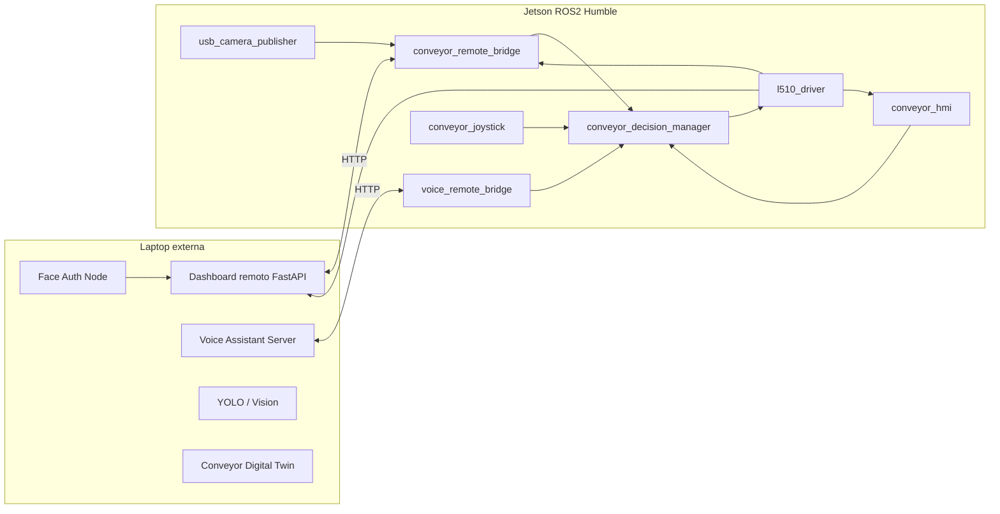

# ros2-conveyor-local-services

<div align="center">

# 🦾 ROS2 Conveyor Local Services

**Local ROS2 Humble control layer for an industrial conveyor belt system running on NVIDIA Jetson.**

Control local para banda transportadora con:

**TECO L510 + RS485 Modbus RTU + ROS2 Humble + HMI táctil + Dashboard remoto + Voice Bridge + Joystick Deadman Switch + Face Authorization + Cámara USB**

</div>

---

## 📌 Descripción general

`ros2-conveyor-local-services` contiene los paquetes ROS2 que corren principalmente en la **NVIDIA Jetson** para controlar localmente una banda transportadora real mediante un variador **TECO L510** comunicado por **Modbus RTU RS485**.

Este repositorio representa la **capa local de control** del sistema. Su responsabilidad es recibir comandos desde distintas interfaces, aplicar reglas de seguridad y jerarquía, y enviar únicamente comandos válidos al nodo que controla físicamente el variador L510.

El sistema integra:

- Control real de banda transportadora con **TECO L510**.
- Comunicación Modbus RTU vía **RS485 USB**.
- Dashboard remoto ejecutado en una laptop externa.
- Bridge HTTP ↔ ROS2 para conectar laptop y Jetson.
- Interfaz gráfica local HMI táctil.
- Asistente de voz externo mediante bridge dedicado.
- Joystick como **Deadman Switch**.
- Autorización por reconocimiento facial.
- Cámara USB para transmisión al dashboard y procesamiento remoto.
- Decision Manager centralizado para seguridad, autorización y prioridad de comandos.

---

## 🧠 Arquitectura general

El sistema está dividido en dos lados principales:

```text
┌──────────────────────────────────────────────┐
│                 LAPTOP EXTERNA               │
│                                              │
│  Dashboard remoto FastAPI/WebSocket          │
│  Face Recognition / Face Auth                │
│  YOLO / Digital Twin / Visualización         │
│                                              │
│  Endpoints HTTP:                             │
│  /api/commands                               │
│  /api/telemetry                              │
│  /api/frame                                  │
│  /api/face_role                              │
└───────────────────────▲──────────────────────┘
                        │ HTTP
                        │ Ethernet / WiFi
                        ▼
┌──────────────────────────────────────────────┐
│                 NVIDIA JETSON                │
│                                              │
│  conveyor_remote_bridge                      │
│  voice_remote_bridge                         │
│  conveyor_hmi                                │
│  conveyor_joystick                           │
│  conveyor_decision_manager                   │
│  usb_camera_publisher                        │
│  l510_driver                                 │
│                                              │
│  ROS2 Humble Topics                          │
└───────────────────────▼──────────────────────┘
                        │ RS485 Modbus RTU
                        ▼
┌──────────────────────────────────────────────┐
│             TECO L510 + CONVEYOR             │
└──────────────────────────────────────────────┘
```

### Diagrama Mermaid



---

## 📦 Paquetes incluidos

```text
ros2-conveyor-local-services/
└── src/
    ├── conveyor_camera/
    ├── conveyor_decision_manager/
    ├── conveyor_hmi/
    ├── conveyor_joystick/
    ├── conveyor_remote_bridge/
    ├── l510_driver/
    ├── usb_camera_publisher/
    └── voice_remote_bridge/
```

---

# 📦 Descripción de paquetes

## 1. `l510_driver`

Nodo encargado de comunicarse con el variador **TECO L510** usando **Modbus RTU RS485**.

### Funciones principales

- Recibe comandos ROS2 desde `/conveyor/cmd`.
- Interpreta comandos JSON:
  - `forward`
  - `reverse`
  - `stop`
  - `emergency_stop`
  - `set_speed`
- Escribe registros Modbus en el variador L510.
- Lee telemetría del variador.
- Publica telemetría en `/conveyor/telemetry`.

### Tópicos

| Tópico | Tipo | Dirección | Descripción |
|---|---|---|---|
| `/conveyor/cmd` | `std_msgs/String` | Sub | Comandos finales autorizados |
| `/conveyor/telemetry` | `std_msgs/String` | Pub | Telemetría JSON del L510 |

### Formato de comando

```json
{"action":"forward","speed_hz":10.0,"hz":10.0}
```

```json
{"action":"reverse","speed_hz":10.0,"hz":10.0}
```

```json
{"action":"stop"}
```

```json
{"action":"emergency_stop"}
```

```json
{"action":"set_speed","speed_hz":20.0,"hz":20.0}
```

### Telemetría publicada

```json
{
  "state": 7,
  "error": 0,
  "freq_cmd_hz": 10.0,
  "freq_out_hz": 9.8,
  "current_raw": 5,
  "timestamp": 1780000000.0
}
```

### Registros Modbus usados

| Registro | Descripción |
|---|---|
| `9473` | Control word / RUN STOP direction |
| `9474` | Frecuencia de referencia, escala 0.01 Hz |
| `9504` | Estado del variador |
| `9505` | Código de error |
| `9507` | Frecuencia comandada leída |
| `9508` | Frecuencia real de salida |
| `9511` | Corriente de salida |

### Configuración del TECO L510

Parámetros configurados en el variador:

| Parámetro | Valor | Descripción |
|---|---:|---|
| `00-02` | `2` | Fuente RUN por comunicación |
| `00-03` | `0` | Dirección controlada por comunicación |
| `00-05` | `5` | Frecuencia por comunicación |
| `00-06` | `2` | Fuente secundaria por comunicación |
| `09-00` | `1` | Slave ID |
| `09-01` | `0` | Comunicación |
| `09-02` | `1` | Baudrate/config |
| `09-03` | `0` | Comunicación |
| `09-04` | `0` | Comunicación |
| `09-05` | `0` | Comunicación |

### Ejecutar con `ros2 run`

```bash
ros2 run l510_driver l510_node \
  --ros-args \
  -p port:=/dev/l510_rs485 \
  -p slave:=1 \
  -p baudrate:=9600
```

---

## 2. `conveyor_decision_manager`

Nodo central de decisión. Es el cerebro del sistema local.

Recibe comandos desde:

- GUI local.
- Dashboard remoto.
- Asistente de voz.

Y decide si pueden llegar al L510 considerando:

1. Deadman Switch activo.
2. Autorización facial.
3. Jerarquía de prioridad.
4. Tipo de comando.

### Jerarquía de interfaces

| Fuente | Tópico | Prioridad |
|---|---|---:|
| GUI local | `/cmd/gui` | 3 |
| Dashboard remoto | `/cmd/dashboard` | 2 |
| Voz | `/cmd/voice` | 1 |

### Capas de seguridad

```mermaid
flowchart TD
    A[Comando entrante] --> B{Deadman activo?}
    B -- No --> C[Publicar STOP]
    B -- Sí --> D{Autorización facial}
    D -- jefe --> E[Permitir todo]
    D -- trabajador --> F[Permitir solo STOP]
    D -- otro/unknown --> G[Rechazar comando]
    D -- none --> H[Modo normal]
    E --> I{Prioridad}
    F --> I
    H --> I
    I --> J[/conveyor/cmd]
```

### Reglas de autorización facial

| Rol | Acciones permitidas |
|---|---|
| `jefe` | Todas |
| `trabajador` | Solo `stop` y `emergency_stop` |
| `otro` | Ninguna |
| `unknown` | Ninguna |
| `none` | Modo normal |

> `stop` y `emergency_stop` siempre deben permitirse por seguridad.

### Tópicos

| Tópico | Tipo | Dirección | Descripción |
|---|---|---|---|
| `/cmd/gui` | `std_msgs/String` | Sub | Comandos desde HMI local |
| `/cmd/dashboard` | `std_msgs/String` | Sub | Comandos desde dashboard remoto |
| `/cmd/voice` | `std_msgs/String` | Sub | Comandos desde asistente de voz |
| `/safety/deadman` | `std_msgs/String` | Sub | Estado del deadman switch |
| `/auth/face_role` | `std_msgs/String` | Sub | Rol detectado por face auth |
| `/conveyor/cmd` | `std_msgs/String` | Pub | Comando final autorizado |

### Formato de `/safety/deadman`

```json
{
  "pressed": true,
  "timestamp": 1780000000.0,
  "source": "joystick",
  "button": 2
}
```

### Formato de `/auth/face_role`

```json
{
  "role": "jefe",
  "name": "didier",
  "confidence": 0.9,
  "face_detected": true,
  "timestamp": 1780000000.0
}
```

### Ejecutar con `ros2 run`

```bash
ros2 run conveyor_decision_manager decision_manager_node \
  --ros-args \
  -p gui_topic:=/cmd/gui \
  -p dashboard_topic:=/cmd/dashboard \
  -p voice_topic:=/cmd/voice \
  -p deadman_topic:=/safety/deadman \
  -p auth_topic:=/auth/face_role \
  -p output_topic:=/conveyor/cmd \
  -p require_deadman:=true
```

### Ejecutar sistema completo

```bash
ros2 launch conveyor_decision_manager full_conveyor_system.launch.py \
  voice_server_ip:=192.168.50.3
```

---

## 3. `conveyor_remote_bridge`

Bridge entre la Jetson y el dashboard remoto que corre en la laptop.

### Funciones principales

- Consulta comandos del dashboard:
  - `GET /api/commands`
- Publica esos comandos en:
  - `/cmd/dashboard`
- Envía telemetría local hacia el dashboard:
  - `POST /api/telemetry`
- Envía cámara comprimida hacia el dashboard:
  - `POST /api/frame`
- Consulta autorización facial del dashboard:
  - `GET /api/face_role`
- Publica autorización facial en:
  - `/auth/face_role`

### Arquitectura del bridge

```text
Laptop Dashboard API
    │
    ├── GET  /api/commands      → /cmd/dashboard
    ├── GET  /api/face_role     → /auth/face_role
    ├── POST /api/telemetry     ← /conveyor/telemetry
    └── POST /api/frame         ← /camera/image/compressed
```

### Parámetros principales

| Parámetro | Default | Descripción |
|---|---|---|
| `server_url` | `http://localhost:8000` | URL del dashboard remoto |
| `poll_period` | `0.5` | Periodo de consulta HTTP |
| `send_camera` | `True` | Enviar cámara al dashboard |
| `output_cmd_topic` | `/cmd/dashboard` | Tópico destino de comandos |
| `auth_topic` | `/auth/face_role` | Tópico destino de autorización |

### Ejecutar con `ros2 run`

```bash
ros2 run conveyor_remote_bridge remote_bridge_node \
  --ros-args \
  -p server_url:=http://192.168.50.1:8000 \
  -p output_cmd_topic:=/cmd/dashboard \
  -p auth_topic:=/auth/face_role \
  -p poll_period:=0.5 \
  -p send_camera:=true
```

---

## 4. `voice_remote_bridge`

Bridge dedicado para conectar un servidor externo de asistente de voz con ROS2 Humble en la Jetson.

### Funciones principales

- Consulta comandos desde el servidor de voz.
- Publica comandos en `/cmd/voice`.
- Mantiene aislada la lógica de voz del dashboard remoto.

### Flujo

```text
Voice Assistant Server
        │
        │ GET /api/commands
        ▼
voice_remote_bridge
        │
        ▼
/cmd/voice
        │
        ▼
conveyor_decision_manager
```

### Ejecutar con `ros2 run`

```bash
ros2 run voice_remote_bridge voice_bridge_node \
  --ros-args \
  -p server_url:=http://192.168.50.3:8010 \
  -p output_cmd_topic:=/cmd/voice \
  -p poll_period:=0.5
```

---

## 5. `conveyor_hmi`

Interfaz gráfica local para pantalla táctil conectada a la Jetson.

### Funciones principales

- Botones:
  - Forward
  - Reverse
  - Stop
  - Emergency Stop
- Slider de velocidad inicial en 10 Hz.
- Publica comandos en `/cmd/gui`.
- Lee telemetría desde `/conveyor/telemetry`.
- Pantalla completa automática.
- Diseñada para display táctil local.

### Flujo

```text
Touch HMI
   │
   ▼
/cmd/gui
   │
   ▼
conveyor_decision_manager
   │
   ▼
/conveyor/cmd
```

### Ejecutar con `ros2 run`

```bash
DISPLAY=:0 XAUTHORITY=/home/jetsonherbie/.Xauthority \
ros2 run conveyor_hmi touch_hmi_node \
  --ros-args \
  -p cmd_topic:=/cmd/gui \
  -p telemetry_topic:=/conveyor/telemetry
```

Si ya exportaste variables de display:

```bash
ros2 run conveyor_hmi touch_hmi_node \
  --ros-args \
  -p cmd_topic:=/cmd/gui \
  -p telemetry_topic:=/conveyor/telemetry
```

---

## 6. `conveyor_joystick`

Nodo para convertir el estado de un joystick en un **Deadman Switch**.

### Función principal

Mientras el botón configurado esté presionado, publica:

```json
{"pressed": true}
```

Cuando se suelta o se pierde el joystick, publica:

```json
{"pressed": false}
```

El `decision_manager` revisa este tópico constantemente. Si el deadman está inactivo, manda `stop` automático.

### Tópicos

| Tópico | Tipo | Dirección | Descripción |
|---|---|---|---|
| `/joy` | `sensor_msgs/Joy` | Sub | Entrada del joystick |
| `/safety/deadman` | `std_msgs/String` | Pub | Estado deadman |

### Ejecutar `joy_node`

```bash
ros2 run joy joy_node
```

### Verificar botones

```bash
ros2 topic echo /joy
```

Si ves:

```yaml
buttons:
- 0
- 0
- 1
```

el botón presionado es índice `2`.

### Ejecutar deadman

```bash
ros2 run conveyor_joystick joy_mapper_node \
  --ros-args \
  -p btn_deadman:=2 \
  -p deadman_topic:=/safety/deadman \
  -p publish_rate_hz:=10.0 \
  -p joy_timeout_sec:=0.5
```

### Verificar deadman

```bash
ros2 topic echo /safety/deadman
```

---

## 7. `usb_camera_publisher`

Nodo de cámara USB para la Jetson.

### Funciones principales

- Abre cámara mediante:
  - `/dev/yolo_camera`
  - `/dev/videoX`
  - índice numérico
- Publica imagen cruda:
  - `/camera/image_raw`
- Publica imagen comprimida:
  - `/camera/image/compressed`
- La imagen comprimida se envía al dashboard remoto por `conveyor_remote_bridge`.

### Tópicos

| Tópico | Tipo | Dirección |
|---|---|---|
| `/camera/image_raw` | `sensor_msgs/Image` | Pub |
| `/camera/image/compressed` | `sensor_msgs/CompressedImage` | Pub |

### Ejecutar con alias fijo

```bash
ros2 run usb_camera_publisher usb_camera_node \
  --ros-args \
  -p camera_device:=/dev/yolo_camera \
  -p width:=640 \
  -p height:=480 \
  -p fps:=15.0 \
  -p publish_compressed:=true \
  -p jpeg_quality:=60
```

### Ejecutar con `/dev/videoX`

```bash
ros2 run usb_camera_publisher usb_camera_node \
  --ros-args \
  -p camera_device:=/dev/video1
```

### Ejecutar con índice

```bash
ros2 run usb_camera_publisher usb_camera_node \
  --ros-args \
  -p camera_device:=0
```

---

## 8. `conveyor_camera`

Paquete reservado para integración de cámara dentro del sistema local de conveyor.

Dependiendo de la versión del workspace, puede usarse para publicar imágenes locales o como capa auxiliar para la cámara de la banda. En la arquitectura actual, el paquete usado para la cámara USB principal es:

```text
usb_camera_publisher
```

---

# 🌐 Endpoints HTTP usados por el dashboard remoto

El dashboard remoto corre en la laptop y expone una API HTTP que consume la Jetson mediante `conveyor_remote_bridge`.

## Endpoints principales

| Método | Endpoint | Dirección | Descripción |
|---|---|---|---|
| `GET` | `/api/commands` | Laptop → Jetson | Bridge consulta comandos nuevos |
| `POST` | `/api/telemetry` | Jetson → Laptop | Bridge envía telemetría del L510 |
| `POST` | `/api/frame` | Jetson → Laptop | Bridge envía frame JPEG comprimido |
| `GET` | `/api/face_role` | Laptop → Jetson | Bridge consulta rol facial |
| `GET` | `/api/status` | Laptop | Estado general del dashboard |

## `/api/commands`

Respuesta esperada:

```json
{
  "ok": true,
  "latest_seq": 3,
  "commands": [
    {
      "seq": 3,
      "timestamp": 1780000000.0,
      "cmd": {
        "action": "forward",
        "speed_hz": 10.0,
        "hz": 10.0
      }
    }
  ]
}
```

## `/api/telemetry`

Payload enviado desde Jetson:

```json
{
  "state": 7,
  "error": 0,
  "freq_cmd_hz": 10.0,
  "freq_out_hz": 9.8,
  "current_raw": 5,
  "timestamp": 1780000000.0
}
```

## `/api/face_role`

Respuesta esperada:

```json
{
  "ok": true,
  "latest_face_role": {
    "role": "jefe",
    "name": "didier",
    "confidence": 0.9,
    "face_detected": true,
    "timestamp": 1780000000.0
  }
}
```

---

# 🔌 Tópicos ROS2 principales

| Tópico | Tipo | Productor | Consumidor |
|---|---|---|---|
| `/cmd/gui` | `std_msgs/String` | `conveyor_hmi` | `decision_manager` |
| `/cmd/dashboard` | `std_msgs/String` | `conveyor_remote_bridge` | `decision_manager` |
| `/cmd/voice` | `std_msgs/String` | `voice_remote_bridge` | `decision_manager` |
| `/safety/deadman` | `std_msgs/String` | `conveyor_joystick` | `decision_manager` |
| `/auth/face_role` | `std_msgs/String` | `conveyor_remote_bridge` | `decision_manager` |
| `/conveyor/cmd` | `std_msgs/String` | `decision_manager` | `l510_driver` |
| `/conveyor/telemetry` | `std_msgs/String` | `l510_driver` | HMI / bridge |
| `/camera/image_raw` | `sensor_msgs/Image` | `usb_camera_publisher` | otros nodos |
| `/camera/image/compressed` | `sensor_msgs/CompressedImage` | `usb_camera_publisher` | `conveyor_remote_bridge` |
| `/joy` | `sensor_msgs/Joy` | `joy_node` | `conveyor_joystick` |

---

# 🛡️ Capa de seguridad

## Deadman Switch

El sistema requiere que el botón del joystick esté presionado para permitir acciones de movimiento.

Si el deadman está inactivo:

```json
{"action":"stop"}
```

se publica automáticamente hacia `/conveyor/cmd`.

## Face Authorization

El reconocimiento facial corre en la laptop y el resultado llega a Jetson mediante:

```text
Laptop /auth/face_role
→ Dashboard endpoint /api/face_role
→ Jetson conveyor_remote_bridge
→ /auth/face_role
→ decision_manager
```

### Reglas

| Estado facial | Acción |
|---|---|
| `jefe` | Permite todos los comandos |
| `trabajador` | Solo permite detener |
| `otro` | Bloquea comandos |
| `unknown` | Bloquea comandos |
| `none` | Permite modo normal |

---

# 🚀 Launch principal

El launch principal integra los nodos locales de la Jetson.

```bash
ros2 launch conveyor_decision_manager full_conveyor_system.launch.py \
  voice_server_ip:=192.168.50.3
```

Este launch levanta:

- `joy_node`
- `conveyor_joystick`
- `usb_camera_publisher`
- `l510_driver`
- `conveyor_decision_manager`
- `conveyor_hmi`
- `conveyor_remote_bridge`
- `voice_remote_bridge`

---

# ⚙️ Instalación

## 1. Crear workspace

```bash
mkdir -p ~/ros2_ws/src
cd ~/ros2_ws/src
```

## 2. Clonar repositorio

```bash
git clone https://github.com/DidierHernandez2/ros2-conveyor-local-services.git
```

## 3. Instalar dependencias ROS2

```bash
sudo apt update
sudo apt install -y \
  ros-humble-joy \
  ros-humble-cv-bridge \
  ros-humble-sensor-msgs \
  ros-humble-std-msgs \
  python3-pip
```

## 4. Dependencias Python

```bash
pip3 install pymodbus requests opencv-python
```

## 5. Compilar

```bash
cd ~/ros2_ws
source /opt/ros/humble/setup.bash

colcon build --symlink-install

source install/setup.bash
```

---

# 🔗 Alias persistentes `/dev/*`

Para evitar que los dispositivos cambien de nombre (`ttyUSB0`, `video1`, etc.), se usan reglas `udev`.

## L510 RS485

Ejemplo para CH340:

```bash
udevadm info -a -n /dev/ttyUSB0 | grep -E "idVendor|idProduct|serial" | head -20
```

Regla:

```bash
sudo nano /etc/udev/rules.d/99-l510-rs485.rules
```

```text
SUBSYSTEM=="tty", ATTRS{idVendor}=="1a86", ATTRS{idProduct}=="7523", SYMLINK+="l510_rs485", MODE="0666", GROUP="dialout"
```

Recargar:

```bash
sudo udevadm control --reload-rules
sudo udevadm trigger
```

Verificar:

```bash
ls -l /dev/l510_rs485
```

## Cámara YOLO

Cámara Orbbec detectada como:

```text
idVendor=2bc5
idProduct=0501
index=0
```

Regla:

```bash
sudo nano /etc/udev/rules.d/99-yolo-camera.rules
```

```text
SUBSYSTEM=="video4linux", ATTRS{idVendor}=="2bc5", ATTRS{idProduct}=="0501", ATTR{index}=="0", SYMLINK+="yolo_camera", MODE="0666", GROUP="video"
```

Recargar:

```bash
sudo udevadm control --reload-rules
sudo udevadm trigger
```

Verificar:

```bash
ls -l /dev/yolo_camera
```

---

# 🧪 Pruebas rápidas

## Probar deadman manual

```bash
ros2 topic pub /safety/deadman std_msgs/msg/String \
"{data: '{\"pressed\":true}'}" -r 10
```

## Probar jefe

```bash
ros2 topic pub /auth/face_role std_msgs/msg/String \
"{data: '{\"role\":\"jefe\",\"name\":\"didier\",\"confidence\":0.9,\"face_detected\":true}'}" -r 2
```

## Probar comando dashboard

```bash
ros2 topic pub --once /cmd/dashboard std_msgs/msg/String \
"{data: '{\"action\":\"forward\",\"speed_hz\":10.0,\"hz\":10.0}'}"
```

## Ver salida final

```bash
ros2 topic echo /conveyor/cmd
```

## Ver telemetría

```bash
ros2 topic echo /conveyor/telemetry
```

## Ver cámara comprimida

```bash
ros2 topic hz /camera/image/compressed
```

---

# 🧯 Troubleshooting

## El L510 no responde

Revisar:

```bash
ls -l /dev/l510_rs485
sudo lsof /dev/l510_rs485
```

Verificar que la banda esté encendida.

Ejecutar:

```bash
ros2 run l510_driver l510_node \
  --ros-args \
  -p port:=/dev/l510_rs485 \
  -p slave:=1 \
  -p baudrate:=9600
```

## Permission denied en puerto serial

Agregar usuario a `dialout`:

```bash
sudo usermod -aG dialout $USER
newgrp dialout
```

## Cámara no abre

Revisar:

```bash
v4l2-ctl --list-devices
ls -l /dev/yolo_camera
```

Probar:

```bash
python3 - << 'PY'
import cv2
cap = cv2.VideoCapture("/dev/yolo_camera")
print(cap.isOpened())
PY
```

## Joystick no aparece

Verificar:

```bash
ls /dev/input/js*
```

Cargar módulos:

```bash
sudo modprobe joydev
sudo modprobe xpad
```

Ejecutar:

```bash
ros2 run joy joy_node
ros2 topic echo /joy
```

## GUI no abre por SSH

Usar:

```bash
export DISPLAY=:0
export XAUTHORITY=/home/jetsonherbie/.Xauthority
```

o correr desde launch principal que ya establece estas variables.

## Dashboard no recibe comandos

Verificar que la laptop sea accesible desde Jetson:

```bash
curl http://192.168.50.1:8000/api/status
```

Ver logs del bridge:

```bash
ros2 run conveyor_remote_bridge remote_bridge_node \
  --ros-args \
  -p server_url:=http://192.168.50.1:8000
```

---

# 🧱 Estructura recomendada del repo

```text
ros2-conveyor-local-services/
├── README.md
├── .gitignore
└── src/
    ├── conveyor_camera/
    ├── conveyor_decision_manager/
    │   ├── conveyor_decision_manager/
    │   │   └── decision_manager_node.py
    │   └── launch/
    │       └── full_conveyor_system.launch.py
    ├── conveyor_hmi/
    ├── conveyor_joystick/
    │   └── conveyor_joystick/
    │       └── joy_mapper_node.py
    ├── conveyor_remote_bridge/
    │   └── conveyor_remote_bridge/
    │       └── remote_bridge_node.py
    ├── l510_driver/
    │   └── l510_driver/
    │       └── l510_node.py
    ├── usb_camera_publisher/
    │   └── usb_camera_publisher/
    │       └── usb_camera_node.py
    └── voice_remote_bridge/
        └── voice_remote_bridge/
            └── voice_bridge_node.py
```

---

# 🧭 Comandos útiles

## Build completo

```bash
cd ~/ros2_ws
source /opt/ros/humble/setup.bash
colcon build --symlink-install
source install/setup.bash
```

## Launch completo

```bash
ros2 launch conveyor_decision_manager full_conveyor_system.launch.py \
  voice_server_ip:=192.168.50.3
```

## Ver nodos activos

```bash
ros2 node list
```

## Ver tópicos

```bash
ros2 topic list
```

## Debug de comandos

```bash
ros2 topic echo /cmd/gui
ros2 topic echo /cmd/dashboard
ros2 topic echo /cmd/voice
ros2 topic echo /conveyor/cmd
```

## Debug de seguridad

```bash
ros2 topic echo /safety/deadman
ros2 topic echo /auth/face_role
```

---

# 📌 Estado final del sistema

Este repositorio implementa la capa local del sistema de banda transportadora:

```text
Interfaces externas/locales
        ↓
Bridges y HMI
        ↓
Decision Manager
        ↓
L510 Driver
        ↓
Banda transportadora real
```

Incluye seguridad por:

- Deadman Switch físico.
- Autorización facial.
- Prioridad de interfaz.
- Stop automático.
- Separación entre comandos remotos y ejecución física.

---

# 👥 Equipo

Proyecto desarrollado como parte del sistema de robótica y sistemas inteligentes del equipo **Fantastic Four**.

---

# 📄 Licencia

Pendiente de definir.
